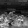
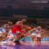

# Video-Colorization

## Intro 

This is a simple pytorch implementation of image colorization, based on "Tracking Emerges by coloring videos". 

## Result

I now completed the colorization part, for simplication, I resize all the input images to size (56*56).

- Input L:

- Prediction:

- Groundtruth:

